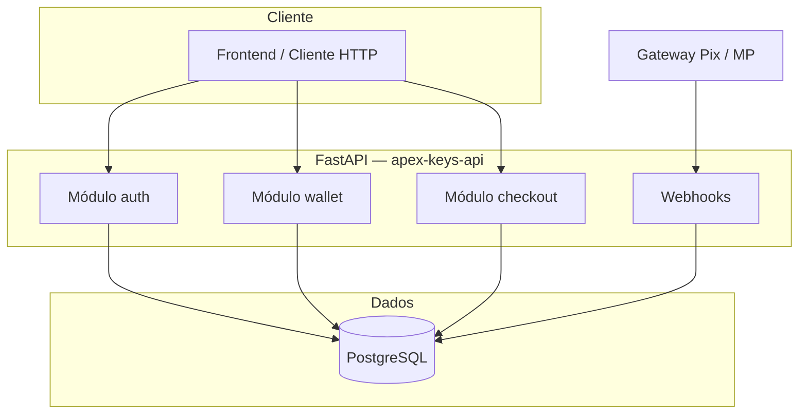

<div align="center">


# Apex Keys API

**Backend de alta performance para sorteios de chaves Steam com carteira pré-paga, Pix e trilha de auditoria financeira.**

[](https://www.python.org/)
[](https://fastapi.tiangolo.com/)
[](https://www.postgresql.org/)
[](LICENSE)

</div>

---

## Identidade visual

Ativos oficiais da marca em [`images/`](images/). Uso sugerido: **hero e documentação** (completa), **favicon / ícones compactos** (sem mascote), **fundos escuros ou sobreposições** (versão sem fundo).

<table>
  <thead>
    <tr>
      <th align="center">Logo completa</th>
      <th align="center">Sem mascote</th>
      <th align="center">Marca sem fundo</th>
    </tr>
  </thead>
  <tbody>
    <tr>
      <td align="center" valign="top">
        <br>
        <sub><code>images/apex logo.png</code></sub>
      </td>
      <td align="center" valign="top">
        <br>
        <sub><code>images/logo no wolf.png</code></sub>
      </td>
      <td align="center" valign="top">
        <br>
        <sub><code>images/logo no background.png</code></sub>
      </td>
    </tr>
  </tbody>
</table>

---

## Sumário

| | |
|:---|:---|
| [Identidade visual](#identidade-visual) | Logos e ficheiros em `images/` |
| [Visão geral](#visão-geral) | Propósito, escopo e princípios de desenho |
| [Arquitetura](#arquitetura) | Camadas, dados e fluxos críticos |
| [Stack](#stack-tecnológica) | Dependências e versões alvo |
| [Instalação](#instalação) | Ambiente virtual, dependências e variáveis |
| [Banco de dados](#banco-de-dados) | Schema, transações e integridade |
| [API](#referência-da-api) | Endpoints, autenticação e contratos |
| [Operação](#operação-e-observabilidade) | Health, logs e erros |
| [Segurança](#segurança) | CORS, JWT, SQL e boas práticas |
| [Deploy](#deploy) | Railway e variáveis de produção |
| [Repositório](#estrutura-do-repositório) | Mapa de diretórios |

---

## Visão geral

A **Apex Keys API** expõe serviços REST para uma plataforma em que usuários **depositam créditos via Pix** (confirmados por webhook do gateway), **consomem saldo para adquirir números de sorteio** e recebem **estorno automático** quando um administrador cancela uma rifa ainda aberta. O desenho prioriza:

- **Consistência forte** em operações financeiras (carteira + bilhete + lançamento contábil na mesma transação de banco).
- **SQL explícito** com `asyncpg` e pool assíncrono, sem ORM pesado.
- **Contratos de entrada rígidos** via **Pydantic v2** e respostas de erro padronizadas, sem vazamento de stack trace ao cliente.

A documentação interativa OpenAPI fica disponível em `/docs` e `/redoc` quando a aplicação está em execução.

---

## Arquitetura



**Fluxo resumido**

1. **Créditos:** cria-se um registro `transactions` do tipo `pix_deposit` em estado `pending`; o webhook confirma pagamento, marca `completed` e incrementa `wallet_balance`.
2. **Compra de bilhete:** numa única transação SQL, bloqueia-se rifa e usuário (`FOR UPDATE`), valida-se saldo e disponibilidade do número, debita carteira, insere `tickets` (`paid`) e registra `transactions` (`purchase`, `completed`).
3. **Cancelamento administrativo:** rifa em `open` passa a `canceled`; para cada bilhete `paid`, credita-se o valor unitário na carteira e cria-se `transactions` (`refund`, `completed`).

---

## Stack tecnológica

| Camada | Tecnologia | Observação |
|--------|------------|------------|
| Runtime | Python 3.10+ | Tipagem e `async`/`await` end-to-end na camada de IO |
| HTTP | FastAPI | Rotas funcionais, injeção de dependências, OpenAPI automático |
| Validação | Pydantic v2 | Schemas de request/response e settings |
| Banco | PostgreSQL | Constraints, `UNIQUE(raffle_id, ticket_number)`, checks de saldo |
| Driver | asyncpg | Pool assíncrono, queries parametrizadas |
| Autenticação | JWT + Passlib (bcrypt) | Bearer token; papel `admin` para rotas sensíveis |

---

## Instalação

### Pré-requisitos

- Python **3.10** ou superior  
- Instância **PostgreSQL** acessível (local, Docker ou provedor gerenciado)  
- Arquivo **`.env`** na raiz do projeto (nunca commitado)

### Passos

```bash
git clone <url-do-repositório>
cd apex-keys-api

python3 -m venv .venv
source .venv/bin/activate   # Windows: .venv\Scripts\activate

pip install -r requirements.txt
cp .env.example .env
# Edite .env com DATABASE_URL, JWT_SECRET e CORS_ORIGINS
```

Aplicar o schema inicial (exemplo com `psql` ou cliente equivalente):

```bash
psql "$DATABASE_URL" -f schema.sql
```

> **Nota:** Em provedores como Railway, conexões externas costumam exigir `?sslmode=require` na URL. Serviços **dentro** da mesma rede podem usar hostname interno (por exemplo `*.railway.internal`).

### Executar o servidor

```bash
uvicorn app.main:app --reload --host 0.0.0.0 --port 8000
```

| URL | Descrição |
|-----|-----------|
| `http://localhost:8000/docs` | Swagger UI (OpenAPI) |
| `http://localhost:8000/redoc` | ReDoc |
| `GET /health` | Verificação liveness simples |

---

## Banco de dados

O arquivo [`schema.sql`](schema.sql) define:

| Tabela | Função |
|--------|--------|
| `users` | Cadastro, papel (`user` / `admin`), `wallet_balance` ≥ 0 |
| `raffles` | Sorteios, faixa de números, preço unitário, status |
| `tickets` | Número vendido por rifa; unicidade por `(raffle_id, ticket_number)` |
| `transactions` | Auditoria: `pix_deposit`, `purchase`, `refund`, `admin_adjustment` |

Extensão **`uuid-ossp`** habilitada para geração de UUIDs no servidor de banco.

---

## Referência da API

### Autenticação

Rotas protegidas esperam cabeçalho:

```http
Authorization: Bearer <access_token>
```

O token é emitido em `POST /auth/login` e identifica o usuário pelo claim `sub` (UUID).

### Endpoints

| Método | Caminho | Autenticação | Descrição |
|--------|---------|--------------|-----------|
| `POST` | `/auth/register` | — | Cadastro de usuário |
| `POST` | `/auth/login` | — | Login; retorna JWT |
| `GET` | `/auth/me` | Usuário | Perfil e saldo agregado no modelo público |
| `GET` | `/wallet/balance` | Usuário | Saldo da carteira |
| `GET` | `/wallet/transactions` | Usuário | Até 200 lançamentos recentes |
| `POST` | `/wallet/mock-pix-intent` | Usuário | Cria `pix_deposit` **pending** + payload mock (desenvolvimento) |
| `GET` | `/raffles` | — | Lista rifas; query opcional `?status=open\|closed\|canceled` |
| `POST` | `/buy-ticket` | Usuário | Compra atômica de um número em rifa `open` |
| `POST` | `/admin/raffles/{raffle_id}/cancel` | **Admin** | Cancela rifa aberta e estorna bilhetes pagos |
| `POST` | `/webhook/mp` | — | Mock Mercado Pago: aprovação de Pix pendente |
| `GET` | `/health` | — | Status do serviço |

### Corpos de exemplo

**Login**

```json
{
  "email": "usuario@exemplo.com",
  "password": "********"
}
```

**Compra de bilhete**

```json
{
  "raffle_id": "550e8400-e29b-41d4-a716-446655440000",
  "ticket_number": 42
}
```

**Webhook (mock)**

```json
{
  "gateway_reference": "id-único-do-gateway",
  "status": "approved"
}
```

Códigos HTTP usuais: `200` / `201` sucesso, `400` regra de negócio, `401` / `403` autenticação/autorização, `402` saldo insuficiente (compra), `404` recurso ausente, `409` conflito (duplicidade, número vendido), `422` validação Pydantic, `500` erro interno genérico (sem detalhe de implementação).

---

## Operação e observabilidade

- **Logs:** erros não tratados são registrados no logger `apex_keys` com stack trace **no servidor**; a resposta HTTP `500` expõe apenas mensagem genérica ao cliente.
- **Validação:** respostas `422` incluem `detail` e lista `errors` compatível com o formato FastAPI/Pydantic.
- **CORS:** origens permitidas vêm exclusivamente de `CORS_ORIGINS` (lista separada por vírgulas). Lista vazia resulta em **nenhuma** origem de browser liberada por CORS.

---

## Segurança

| Tópico | Implementação |
|--------|----------------|
| Senhas | Hash **bcrypt** via Passlib; senhas nunca persistidas em claro |
| API | JWT assinado; expiração configurável (`ACCESS_TOKEN_EXPIRE_MINUTES`) |
| SQL | Apenas queries parametrizadas (`$1`, `$2`, …) — mitigação a injeção SQL |
| Segredos | `JWT_SECRET` e `DATABASE_URL` apenas em variáveis de ambiente / `.env` ignorado pelo Git |
| Webhook | Implementação atual é **mock**; em produção: validar assinatura do provedor, IP allowlist e idempotência por `gateway_reference` |

---

## Deploy

1. Defina as mesmas variáveis descritas em [`.env.example`](.env.example) no painel do provedor (Railway, Fly.io, etc.).
2. Use a **URL interna** do Postgres para o serviço da API quando ambos estiverem na mesma rede.
3. Comando típico de processo web:

```bash
uvicorn app.main:app --host 0.0.0.0 --port ${PORT:-8000}
```

4. Garanta que o **schema** foi aplicado uma vez no banco antes de receber tráfego.

---

## Variáveis de ambiente

| Variável | Obrigatória | Descrição |
|----------|-------------|-----------|
| `DATABASE_URL` | Sim* | DSN PostgreSQL (`sslmode=require` quando exigido pelo host) |
| `JWT_SECRET` | Sim* | Segredo forte para assinatura JWT |
| `JWT_ALGORITHM` | Não | Padrão: `HS256` |
| `ACCESS_TOKEN_EXPIRE_MINUTES` | Não | Padrão: `30` |
| `CORS_ORIGINS` | Não | Origens permitidas, separadas por vírgula |

\*Valores padrão em `app/config.py` existem apenas para desenvolvimento local; **produção deve sempre sobrescrever**.

---

## Estrutura do repositório

```text
apex-keys-api/
├── app/
│   ├── main.py           # Aplicação, CORS, lifespan, handlers globais
│   ├── config.py         # Settings (pydantic-settings)
│   ├── database.py       # Pool asyncpg, fetch/execute, transações
│   ├── schemas.py        # Modelos Pydantic v2
│   ├── security.py       # JWT, bcrypt, dependências de auth
│   ├── utils.py          # Utilitários (ex.: mock Pix)
│   └── routes/
│       ├── auth.py
│       ├── wallet.py
│       ├── checkout.py
│       └── webhooks.py
├── images/               # Identidade visual (logos)
│   ├── apex logo.png
│   ├── logo no wolf.png
│   └── logo no background.png
├── schema.sql            # DDL PostgreSQL
├── requirements.txt
├── .env.example
└── README.md
```

---

## Licença

Este projeto está licenciado sob a **Licença MIT** — ver o arquivo [LICENSE](LICENSE).

---

<div align="center">

**Apex Keys API** · Documentação gerada a partir do código-fonte · OpenAPI em `/docs`

</div>
