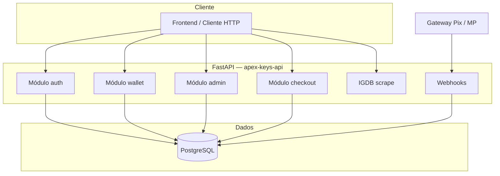

<div align="center">


**Backend de alta performance para sorteios de chaves Steam com carteira pré-paga, Pix e trilha de auditoria financeira.**

[](https://www.python.org/)
[](https://fastapi.tiangolo.com/)
[](https://www.postgresql.org/)
[](LICENSE)

</div>

---

## Sumário

| | |
|:---|:---|
| [Visão geral](#visão-geral) | Propósito, escopo e princípios de desenho |
| [Funcionalidades](#funcionalidades) | O que a API oferece (carteira, rifas, admin, IGDB, dev) |
| [Arquitetura](#arquitetura) | Camadas, dados e fluxos críticos |
| [Stack](#stack-tecnológica) | Dependências e versões alvo |
| [Instalação](#instalação) | Ambiente virtual, dependências e variáveis |
| [Banco de dados](#banco-de-dados) | Schema, transações e integridade |
| [API](#referência-da-api) | Endpoints, autenticação e contratos |
| [Frontend](FRONTEND_API.md) | Guia detalhado para integração do cliente |
| [Operação](#operação-e-observabilidade) | Health, logs e erros |
| [Segurança](#segurança) | CORS, JWT, SQL e boas práticas |
| [Deploy](#deploy) | Vercel, Railway e variáveis de produção |
| [Repositório](#estrutura-do-repositório) | Mapa de diretórios |

---

## Visão geral

A **Apex Keys API** expõe serviços REST para uma plataforma em que usuários **depositam créditos via Pix** (confirmados por webhook do gateway), **consomem saldo para adquirir números de sorteio** e recebem **estorno automático** quando um administrador cancela uma rifa ativa. O desenho prioriza:

- **Consistência forte** em operações financeiras (carteira + bilhete + lançamento contábil na mesma transação de banco).
- **SQLAlchemy 2.0** assíncrono com **asyncpg**, modelos declarativos e `create_all` no arranque da app.
- **Contratos de entrada rígidos** via **Pydantic v2** e respostas de erro padronizadas, sem vazamento de stack trace ao cliente.

A documentação interativa OpenAPI fica disponível em `/docs` e `/redoc` quando a aplicação está em execução.

---

## Funcionalidades

### Contas e autenticação

- **Cadastro** (`POST /auth/signup`): nome completo, e-mail, senha, WhatsApp (validação e unicidade).
- **Login** (`POST /auth/login`): JWT Bearer; o token identifica o utilizador pelo `sub` (UUID).
- **Perfil** (`GET /auth/me`): dados públicos do utilizador, **saldo** e flag **`is_admin`** (para o frontend adaptar UI; rotas admin revalidam na base de dados).

### Carteira e Pix (mock)

- **Saldo** (`GET /wallet/balance`) e **extrato** (`GET /wallet/transactions`, até 200 movimentos).
- **Intent Pix de desenvolvimento** (`POST /wallet/mock-pix-intent`): cria `pix_deposit` em `pending` com `gateway_reference` único e devolve payload EMV fictício para integração de UI.
- **Webhook mock** (`POST /webhook/mp`): confirma depósitos pendentes por `gateway_reference`, credita saldo e marca a transação como `completed` (idempotente se já estava concluída).

### Rifas e checkout

- **Listagem pública** (`GET /raffles`) com filtro opcional `?status=active|sold_out|finished|canceled`.
- **Compra de bilhete** (`POST /buy-ticket`): número único por rifa, débito atómico do saldo, transação `purchase` e transição da rifa para `sold_out` quando esgotar.

### Painel administrativo

- **Criar rifa** (`POST /admin/raffles`): título, imagem, vídeo (YouTube), preço total e quantidade de bilhetes; o **preço por bilhete** é calculado com divisão e arredondamento **half-up** a duas casas (`app/pricing.py`).
- **Cancelar rifa** (`POST /admin/raffles/{id}/cancel`): só rifas `active`; estorna cada bilhete pago e regista `refund`.
- **Ajuste manual de saldo** (`POST /admin/users/{user_id}/adjust-balance`): crédito ou débito com descrição opcional e registo `admin_adjustment` (útil para suporte e testes).

### Metadados de jogos (IGDB)

- **Scrape por URL** (`POST /igdb/game`): envia a URL pública `https://www.igdb.com/games/<slug>`; validação anti-SSRF; extração de título, resumo, imagem, vídeo, géneros e mais (httpx + fallback cloudscraper / BeautifulSoup). **Não** exige JWT Apex Keys.

### Ferramentas de desenvolvimento

| Script | Uso |
|--------|-----|
| [`scripts/apply_schema.py`](scripts/apply_schema.py) | Aplica o mesmo esquema que o `init_db` (`create_all`) e termina. |
| [`scripts/reset_and_apply_schema.py`](scripts/reset_and_apply_schema.py) | `drop_all` + `create_all` (apaga dados; usar com cuidado). |
| [`scripts/seed_test_data.py`](scripts/seed_test_data.py) | Cria utilizadores de exemplo (admin + user) com palavra-passe definida no script. |
| [`scripts/test_endpoints.py`](scripts/test_endpoints.py) | Percorre login, carteira, admin, rifas, mock Pix e webhook contra `http://localhost:8000`. |

Carregamento de `.env` na raiz é partilhado por `dev.py` e pelos scripts via [`app/dotenv_loader.py`](app/dotenv_loader.py).

---

## Arquitetura



**Fluxo resumido**

1. **Créditos:** registo `transactions` tipo `pix_deposit` em `pending`; o webhook confirma, passa a `completed` e incrementa **`users.balance`**.
2. **Compra de bilhete:** na mesma transação de base de dados, bloqueio de rifa e utilizador (`FOR UPDATE`), validação de saldo e do número, débito, `tickets` (`paid`) e `transactions` (`purchase`, `completed`).
3. **Cancelamento administrativo:** rifa `active` → `canceled`; para cada bilhete pago, crédito na carteira e `transactions` (`refund`, `completed`).
4. **Ajuste de saldo (admin):** alteração directa de `balance` com registo `admin_adjustment` (`completed`).

---

## Stack tecnológica

| Camada | Tecnologia | Observação |
|--------|------------|------------|
| Runtime | Python 3.10+ | Tipagem e `async`/`await` end-to-end na camada de IO |
| HTTP | FastAPI | Rotas funcionais, injeção de dependências, OpenAPI automático |
| Validação | Pydantic v2 | Schemas de request/response e settings |
| ORM / SQL | SQLAlchemy 2 (async) | Modelos em `app/models.py`, sessões por request, `create_all` no lifespan |
| Banco | PostgreSQL | Constraints, `UNIQUE(raffle_id, ticket_number)`, saldo coerente com transações |
| Driver | asyncpg | Usado pelo dialecto assíncrono do SQLAlchemy |
| Autenticação | JWT + bcrypt | Bearer token; `admin` validado na BD nas rotas protegidas |

---

## Instalação

### Pré-requisitos

- Python **3.10** ou superior  
- Instância **PostgreSQL** acessível (local, Docker ou provedor gerenciado)  
- Arquivo **`.env`** na raiz do projeto (nunca commitado)

### Passos

```bash
git clone <url-do-repositório>
cd apex-keys-api

python3 -m venv .venv
source .venv/bin/activate   # Windows: .venv\Scripts\activate

pip install -r requirements.txt
cp .env.example .env
# Edite .env com DATABASE_URL, JWT_SECRET e CORS_ORIGINS
```

O arranque da API executa **`Base.metadata.create_all`** no Postgres (ver `app/database.py` / `init_db`). Para aplicar o esquema sem subir o servidor:

```bash
python scripts/apply_schema.py
```

Alternativa manual: [`schema.sql`](schema.sql) alinhado aos modelos (útil para revisão ou ferramentas que esperem DDL estático):

```bash
psql "$DATABASE_URL" -f schema.sql
```

> **Nota:** Em provedores como Railway, conexões externas costumam exigir `?sslmode=require` na URL. Serviços **dentro** da mesma rede podem usar hostname interno (por exemplo `*.railway.internal`).

### Executar o servidor

```bash
# Opção 1 — script na raiz (reload activo por defeito)
python dev.py

# Opção 2 — uvicorn directo
uvicorn app.main:app --reload --host 0.0.0.0 --port 8000
```

Variáveis opcionais para `dev.py`: `HOST`, `PORT`, `UVICORN_RELOAD` (`0` para desactivar reload).

A documentação para equipas de frontend está em [`FRONTEND_API.md`](FRONTEND_API.md).

| URL | Descrição |
|-----|-----------|
| `http://localhost:8000/docs` | Swagger UI (OpenAPI) |
| `http://localhost:8000/redoc` | ReDoc |
| `GET /health` | Verificação liveness simples |

---

## Banco de dados

A **fonte canónica** em runtime é [`app/models.py`](app/models.py) (SQLAlchemy). O ficheiro [`schema.sql`](schema.sql) espelha o mesmo desenho para SQL estático e revisão.

| Tabela | Função |
|--------|--------|
| `users` | `full_name`, e-mail, `password_hash`, WhatsApp único, **`balance`**, **`is_admin`**, `created_at` |
| `raffles` | Título, mídia, preço total, número de bilhetes, **`ticket_price`** (derivado), status (`active`, `sold_out`, `finished`, `canceled`) |
| `tickets` | Bilhete por rifa e utilizador; unicidade `(raffle_id, ticket_number)` |
| `transactions` | Auditoria: `pix_deposit`, `purchase`, `refund`, `admin_adjustment`; estados `pending` / `completed` / `failed`; `gateway_reference` opcional |

Os UUIDs das chaves primárias são gerados na aplicação (Python); não é obrigatória extensão `uuid-ossp` no Postgres.

---

## Referência da API

### Autenticação

Rotas protegidas esperam cabeçalho:

```http
Authorization: Bearer <access_token>
```

O token é emitido em `POST /auth/login` e identifica o usuário pelo claim `sub` (UUID).

### Endpoints

| Método | Caminho | Autenticação | Descrição |
|--------|---------|--------------|-----------|
| `POST` | `/auth/signup` | — | Cadastro de usuário |
| `POST` | `/auth/login` | — | Login; retorna JWT |
| `GET` | `/auth/me` | Usuário | Perfil (`full_name`, `balance`, `is_admin`, …) |
| `GET` | `/wallet/balance` | Usuário | Saldo (`balance`) |
| `GET` | `/wallet/transactions` | Usuário | Até 200 lançamentos recentes |
| `POST` | `/wallet/mock-pix-intent` | Usuário | Cria `pix_deposit` **pending** + payload mock (desenvolvimento) |
| `GET` | `/raffles` | — | Lista rifas; query opcional `?status=active\|sold_out\|finished\|canceled` |
| `POST` | `/buy-ticket` | Usuário | Compra atômica de um número em rifa `active` |
| `POST` | `/admin/raffles` | **Admin** | Cria rifa (`ticket_price` = divisão de `total_price` / `total_tickets`, **half-up**, 2 casas) |
| `POST` | `/admin/raffles/{raffle_id}/cancel` | **Admin** | Cancela rifa ativa e estorna bilhetes pagos |
| `POST` | `/admin/users/{user_id}/adjust-balance` | **Admin** | Ajuste manual de saldo (+/−) com descrição opcional; registo `admin_adjustment` |
| `POST` | `/webhook/mp` | — | Mock Mercado Pago: aprovação de Pix pendente por `gateway_reference` |
| `POST` | `/igdb/game` | — | Scrape IGDB: corpo JSON `{ "url": "https://www.igdb.com/games/..." }` (sem login) |
| `GET` | `/health` | — | Status do serviço |

### IGDB / metadados de jogos

O endpoint `POST /igdb/game` recebe a **URL completa** da ficha (`url` no JSON), valida **só** `igdb.com` e caminho `/games/<slug>` (anti-SSRF), normaliza para `https://www.igdb.com/games/<slug>` e obtém HTML com **httpx** (tentativa) ou **cloudscraper** + **BeautifulSoup** (Open Graph, meta, JSON-LD). **Não** exige autenticação Apex Keys. Se o anti-bot falhar, resposta `503`.

Detalhe dos campos: [`FRONTEND_API.md`](FRONTEND_API.md).

### Corpos de exemplo

**Login**

```json
{
  "email": "usuario@exemplo.com",
  "password": "********"
}
```

**Compra de bilhete**

```json
{
  "raffle_id": "550e8400-e29b-41d4-a716-446655440000",
  "ticket_number": 42
}
```

**Webhook (mock)**

```json
{
  "gateway_reference": "id-único-do-gateway",
  "status": "approved"
}
```

**Mock Pix — criar intent pendente** (`POST /wallet/mock-pix-intent`)

```json
{
  "amount": "25.50",
  "gateway_reference": "referencia-unica-por-pedido"
}
```

**Ajuste manual de saldo (admin)** (`POST /admin/users/{user_id}/adjust-balance`)

```json
{
  "amount": "50.00",
  "description": "Crédito promocional"
}
```

**Scrape IGDB (URL copiada do site)**

```json
{
  "url": "https://www.igdb.com/games/resident-evil-requiem"
}
```

Códigos HTTP usuais: `200` / `201` sucesso, `400` regra de negócio, `401` / `403` autenticação/autorização, `402` saldo insuficiente (compra), `404` recurso ausente, `409` conflito (duplicidade, número vendido), `422` validação Pydantic, `502` / `503` falhas ou indisponibilidade de serviços externos (ex.: IGDB), `500` erro interno genérico (sem detalhe de implementação).

---

## Operação e observabilidade

- **Logs:** erros não tratados são registrados no logger `apex_keys` com stack trace **no servidor**; a resposta HTTP `500` expõe apenas mensagem genérica ao cliente.
- **Validação:** respostas `422` incluem `detail` e lista `errors` compatível com o formato FastAPI/Pydantic.
- **CORS:** origens permitidas vêm exclusivamente de `CORS_ORIGINS` (lista separada por vírgulas). Lista vazia resulta em **nenhuma** origem de browser liberada por CORS.

---

## Segurança

| Tópico | Implementação |
|--------|----------------|
| Senhas | Hash **bcrypt** (biblioteca nativa); senhas nunca persistidas em claro |
| API | JWT assinado; expiração configurável (`ACCESS_TOKEN_EXPIRE_MINUTES`) |
| SQL | SQLAlchemy / Core com binds parametrizados — mitigação a injeção SQL |
| Segredos | `JWT_SECRET` e `DATABASE_URL` apenas em variáveis de ambiente / `.env` ignorado pelo Git |
| Webhook | Implementação atual é **mock**; em produção: validar assinatura do provedor, IP allowlist e idempotência por `gateway_reference` |

---

## Deploy

### Vercel (alpha)

1. Ligue o repositório em [vercel.com/new](https://vercel.com/new): a plataforma deteta FastAPI via `requirements.txt` e usa [`index.py`](index.py) como entrada ASGI (`app`).
2. No projeto Vercel, defina as variáveis de ambiente do mesmo conjunto que [`.env.example`](.env.example) (`DATABASE_URL`, `JWT_SECRET`, `CORS_ORIGINS`, etc.). O Postgres tem de ser **acessível a partir da internet** (ou usar um túnel/proxy); não há rede privada partilhada com a Vercel.
3. Em `CORS_ORIGINS`, inclua o domínio do frontend e, se precisar de chamadas desde previews da Vercel, as origens `https://<project>.vercel.app` (ou lista explícita de URLs de preview).
4. Garanta que o **schema** existe no Postgres (primeiro arranque da API com `init_db`, ou `python scripts/apply_schema.py`, ou `psql -f schema.sql`).

Desenvolvimento local com o runtime da Vercel (CLI ≥ 48.1.8): `vercel dev`.

### Outros (Railway, Fly.io, VM, etc.)

1. Defina as mesmas variáveis descritas em [`.env.example`](.env.example) no painel do provedor.
2. Use a **URL interna** do Postgres para o serviço da API quando ambos estiverem na mesma rede.
3. Comando típico de processo web:

```bash
uvicorn app.main:app --host 0.0.0.0 --port ${PORT:-8000}
```

4. Garanta que o **schema** foi criado uma vez (`init_db`, `apply_schema.py` ou DDL manual) antes de receber tráfego.

---

## Variáveis de ambiente

| Variável | Obrigatória | Descrição |
|----------|-------------|-----------|
| `DATABASE_URL` | Sim* | DSN PostgreSQL (`sslmode=require` quando exigido pelo host) |
| `JWT_SECRET` | Sim* | Segredo forte para assinatura JWT |
| `JWT_ALGORITHM` | Não | Padrão: `HS256` |
| `ACCESS_TOKEN_EXPIRE_MINUTES` | Não | Padrão: `30` |
| `CORS_ORIGINS` | Não | Origens permitidas, separadas por vírgula |

\*Valores padrão em `app/config.py` existem apenas para desenvolvimento local; **produção deve sempre sobrescrever**.

---

## Estrutura do repositório

```text
apex-keys-api/
├── app/
│   ├── main.py           # Aplicação, CORS, lifespan, handlers globais
│   ├── config.py         # Settings (pydantic-settings)
│   ├── database.py       # Engine async, sessões, URL + SSL para asyncpg
│   ├── models.py         # SQLAlchemy: User, Raffle, Ticket, Transaction
│   ├── deps.py           # Dependências FastAPI (sessão BD, httpx)
│   ├── pricing.py        # Preço por bilhete (half-up)
│   ├── dotenv_loader.py  # Carga de `.env` partilhada (dev + scripts)
│   ├── schemas.py        # Modelos Pydantic v2 (API)
│   ├── security.py       # JWT, bcrypt, auth / admin
│   ├── utils.py          # Mock Pix (payload EMV fictício)
│   ├── igdb_service.py   # IGDB: scrape por URL (cloudscraper + BeautifulSoup)
│   └── routes/
│       ├── auth.py
│       ├── wallet.py
│       ├── admin.py
│       ├── checkout.py
│       ├── webhooks.py
│       └── igdb.py
├── scripts/              # apply_schema, reset, seed, test_endpoints
├── migrations/           # SQL legado / notas de migração (se aplicável)
├── images/               # Logotipo do README e ativos de marca
├── dev.py                # Arranque local (uvicorn + reload)
├── index.py              # Entry ASGI para Vercel (reexporta app.main:app)
├── pyproject.toml        # Metadados + script `app` para a Vercel
├── FRONTEND_API.md       # Contratos e endpoints para o frontend
├── schema.sql            # DDL de referência (alinhado aos modelos)
├── requirements.txt
├── .env.example
└── README.md
```

---

## Licença

Este projeto está licenciado sob a **Licença MIT** — ver o arquivo [LICENSE](LICENSE).

---

<div align="center">

**Apex Keys API** · Documentação gerada a partir do código-fonte · OpenAPI em `/docs`

</div>
